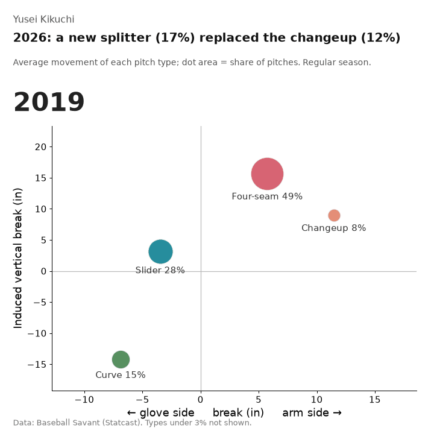
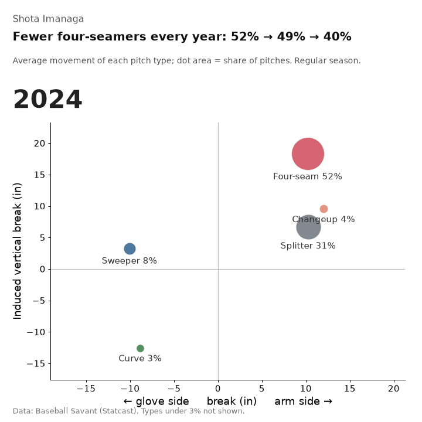
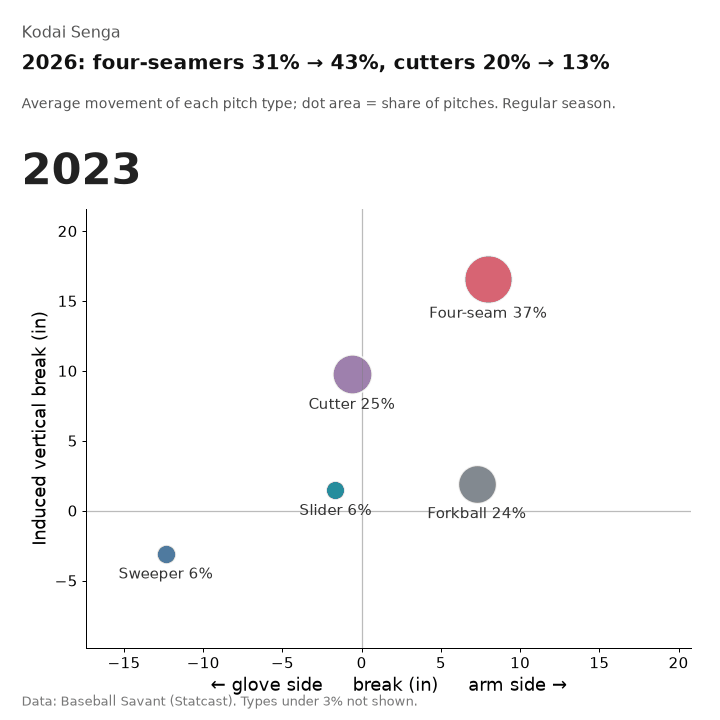
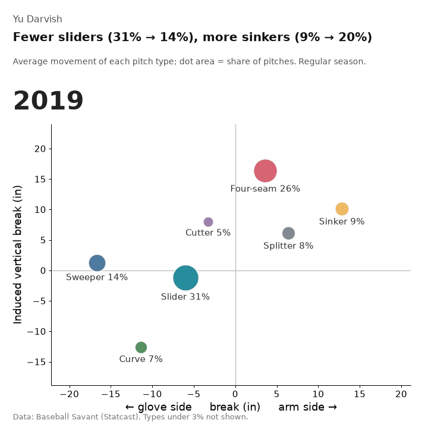

# MLB Statcast Data Visualization

pybaseball + DuckDB + Google Colabで、MLB Statcastデータを可視化・分析するプロジェクトです。

## Datasets

このプロジェクトで使用しているMLB Statcastデータや関連データをKaggleで公開しています。

### 主要データセット

**[Japan MLB Pitchers Batters Statcast (2015-2025)](https://www.kaggle.com/datasets/yasunorim/japan-mlb-pitchers-batters-statcast)**

- 投手25名、118,226投球（2015-2025）
- 打者10名、56,362打撃（2015-2025）
- 選手メタデータ（34選手）

このデータセットを使えば、下記のノートブックと同様の分析を自分でも再現できます。

### 関連データセット

| Dataset | Description | Kaggle |
|---------|-------------|--------|
| [MLB Pitcher Arsenal Evolution (2020-2025)](https://www.kaggle.com/datasets/yasunorim/mlb-pitcher-arsenal-2020-2025) | 投手の球種構成と成績（4,253投手シーズン、111指標） | [View](https://www.kaggle.com/datasets/yasunorim/mlb-pitcher-arsenal-2020-2025) |
| [MLB Bat Tracking (2024-2025)](https://www.kaggle.com/datasets/yasunorim/mlb-bat-tracking-2024-2025) | バット速度・スイング指標（452打者、19指標） | [View](https://www.kaggle.com/datasets/yasunorim/mlb-bat-tracking-2024-2025) |

📋 **全データセットの詳細**: [kaggle-datasets](https://github.com/yasumorishima/kaggle-datasets)

## Notebooks

### 投手分析

| # | 選手 | テーマ | Notebook | Colab | 記事 |
|---|------|--------|----------|-------|------|
| 6 | 菊池雄星 | スライダー革命（2019-2025） | `kikuchi_2019_2025.ipynb` | [](https://colab.research.google.com/github/yasumorishima/mlb-statcast-visualization/blob/main/kikuchi_2019_2025.ipynb) | [Zenn](https://zenn.dev/shogaku/articles/kikuchi-slider-revolution-2019-2025) |
| 5 | 千賀滉大 | お化けフォーク（2023-2025） | `senga_2023_2025.ipynb` | [](https://colab.research.google.com/github/yasumorishima/mlb-statcast-visualization/blob/main/senga_2023_2025.ipynb) | [Zenn](https://zenn.dev/shogaku/articles/senga-ghost-fork-analysis-2023-2025) |
| 4 | 今永昇太 | 2年目の変化（2024-2025） | `imanaga_2024_2025.ipynb` | [](https://colab.research.google.com/github/yasumorishima/mlb-statcast-visualization/blob/main/imanaga_2024_2025.ipynb) | [Zenn](https://zenn.dev/shogaku/articles/imanaga-2nd-year-analysis-2024-2025) |
| 3 | ダルビッシュ有 | 投球スタイル進化（2021-2025） | `darvish_evolution_2021_2025.ipynb` | [](https://colab.research.google.com/github/yasumorishima/mlb-statcast-visualization/blob/main/darvish_evolution_2021_2025.ipynb) | [Zenn](https://zenn.dev/shogaku/articles/darvish-pitching-evolution-2021-2025) |

### 打者分析

| # | 選手 | テーマ | Notebook | Colab | 記事 |
|---|------|--------|----------|-------|------|
| 2 | 大谷翔平 | ヒートマップ（matplotlib手動描画） | `ohtani_2_matplotlib_manual.ipynb` | [](https://colab.research.google.com/github/yasumorishima/mlb-statcast-visualization/blob/main/ohtani_2_matplotlib_manual.ipynb) | [Zenn](https://zenn.dev/shogaku/articles/pybaseball-spraychart-matplotlib) |
| 1 | 大谷翔平 | スプレーチャート（spraychart） | `ohtani_1_spraychart_pybaseball.ipynb` | [](https://colab.research.google.com/github/yasumorishima/mlb-statcast-visualization/blob/main/ohtani_1_spraychart_pybaseball.ipynb) | [Zenn](https://zenn.dev/shogaku/articles/pybaseball-spraychart-builtin) |

## 分析手法

各ノートブックで共通して使用している手法：

- **pybaseball** でStatcastデータ取得
- **DuckDB** でSQLベースのデータ集計（pandas操作より可読性重視）
- **matplotlib / seaborn** で可視化
- テキスト要約セル付き（Claude Codeとの共同分析用）

## 2026 アップデート：球種の変化を動かして見る

上の 4 本（菊池・千賀・今永・ダルビッシュ）の続きです。2026 年の公式戦まで入れて、球種ごとの平均の変化量（横＝利き腕側／グラブ側、縦＝ホップ成分）と投球割合（点の大きさ）が、年ごとにどう動いたかを GIF にしました。

| | |
|---|---|
|  |  |
|  |  |

- **菊池**：2026 年はチェンジアップ（2025 年 12%）が消え、Statcast が「スプリット」と分類する球が 17% に。球速と回転数は前年のチェンジアップとほぼ同じ（86.6 対 85.6 mph）で、利き腕側への変化は約 5 インチ小さい。新しい球なのか分類が変わっただけなのかは、このデータからは区別できない
- **今永**：フォーシームの割合が毎年下がった（52% → 49% → 40%）
- **千賀**：2026 年はフォーシームが 31% → 43%、カッターが 20% → 13%（2024 年は 73 球なので描いていない）
- **ダルビッシュ**：スライダー 31% → 14%、シンカー 9% → 20%（2019 → 2025）。2026 年の登板はなし

作り方と検算は [update-2026/](update-2026/) にあります。描く前に、自分で集計した球数・割合・変化量を Baseball Savant の pitch movement リーダーボードと突き合わせています。食い違えば描きません（球数は 102 行すべてで一致、変化量の差は最大 0.13 インチ）。

## Past Analyses（過去の分析）

以下は [analyses-2022-2024/](analyses-2022-2024/) にある分析です（2026-10-08 に旧 mlb-data-analysis リポジトリを履歴ごと統合）。

### スカウティング・投手分析

| テーマ | 内容 | 手法 | Colab |
|--------|------|------|-------|
| WBC 2023 サンドバル スカウティング | 左打者にスライダー49.2%、被HR 0本 | pybaseball, seaborn | [](https://colab.research.google.com/github/yasumorishima/mlb-statcast-visualization/blob/main/analyses-2022-2024/notebooks/wbc_2023_sandoval_scouting.ipynb) |

### 打者分析・その他

| テーマ | 内容 | 手法 | Colab |
|--------|------|------|-------|
| 大谷翔平 打撃分析（2022） | セカンド付近ヒット集中 →「大谷シフト」の根拠 | pybaseball, matplotlib | [](https://colab.research.google.com/github/yasumorishima/mlb-statcast-visualization/blob/main/analyses-2022-2024/notebooks/ohtani_batting_analysis_2022.ipynb) |
| 大谷翔平 怪我予兆分析（2023） | 複数パラメーター±2σで投球異常を検出 | pybaseball, numpy | [](https://colab.research.google.com/github/yasumorishima/mlb-statcast-visualization/blob/main/analyses-2022-2024/notebooks/ohtani_injury_analysis_2023.ipynb) |
| 大谷翔平 打球速度予測（Random Forest） | コース位置が予測の46%、球速は13%のみ | scikit-learn | [](https://colab.research.google.com/github/yasumorishima/mlb-statcast-visualization/blob/main/analyses-2022-2024/notebooks/ohtani_exit_velocity_random_forest.ipynb) |
| MLB HR Race 2024 | バーチャートレースアニメーション | bar_chart_race | [](https://colab.research.google.com/github/yasumorishima/mlb-statcast-visualization/blob/main/analyses-2022-2024/notebooks/mlb_home_run_race_2024.ipynb) |

> 上記の分析にはSQL版（DuckDB）も用意されています（[analyses-2022-2024/notebooks/sql/](analyses-2022-2024/notebooks/sql/)）。

## セットアップ

```python
!pip install pybaseball duckdb seaborn -q
```

## 注意: game_typeフィルタ

オープン戦のデータを除外するために、必ず`game_type = "R"`でフィルタしてください。

## 参考

- [pybaseball](https://github.com/jldbc/pybaseball)
- [Baseball Savant](https://baseballsavant.mlb.com/)
